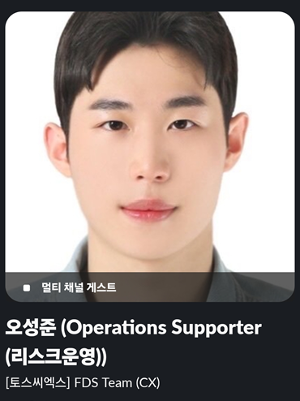

# 📌 오성준 (Oh Sungjun) — Portfolio

  

  <strong>Financial Risk & KYC AI · Anti-Fraud Strategy · Business Risk Quantification · Stablecoin Research</strong>

  📍 <strong>토스씨엑스(Toss CX) FDS Team 재직 중 (Operations Supporter / 리스크운영)</strong> 
  🎯 <strong>Goal: 토스뱅크 Anti-Fraud Manager</strong>

  📧 <a href="mailto:sungjun12110@gmail.com">sungjun12110@gmail.com</a> | 🎓 <a href="mailto:202278035@yiu.ac.kr">202278035@yiu.ac.kr</a> | 💻 <a href="https://github.com/sojo1211">GitHub</a>

---

## 💼 Professional Experience & Risk Operations

### 🔹 토스씨엑스 (Toss CX) FDS Team — Operations Supporter (리스크운영)
* **근무 기간:** 2026.07 ~ 현재 (연장 포함 운영 중)
* **주요 업무 및 성과:**
  * **온보딩 팩터 vs 실제 운영 갭 검수:** 가맹점 입점 시 등록된 6대 리스크 팩터(배송종류, 객단가, 판매형태, 실물/비실물 등)와 실제 웹사이트 및 거래 데이터 간의 불일치를 정밀 검수
  * **RMS 14대 기준 정량 라벨링:** RMS alert 발생 시 토스페이파트너스(TOI/Paybiz)를 통해 MID 기반으로 가맹점 웹사이트를 실사하고, 환금성·배송기간 초과·상품 변질 등 14가지 RMS 기준표에 의거해 리스크 사유 정량 라벨링 수행
  * **가입 시점 분기별 소명 및 공문 통제:** 
    * *2023년 07월 10일 이후 가입 건:* 약관 기준 전자 메일 소명 프로세스 집행
    * *2023년 07월 10일 이전 가입 건:* 내부 결재를 거친 공식 인감 공식 공문 발송 및 제재 통제
  * **선제적 자금 손실 차단:** 미소명 및 고위험 가맹점 대상 지급보류, 결제 OFF(연동 해제), 토스페이 비활성화 등 End-to-End 리스크 통제 실무 수행
  * **AML (Anti-Money Laundering) 역량 내실화:** 현직 리스크 운영 과정에서 자금세탁방지 및 이상거래 탐지/대응 프로세스 체득 완료

---

## 🔍 Data Deep Dive & Risk Quantification Philosophy

저에게 **Data Deep Dive**란 단순한 파이썬 문법 활용을 넘어, *데이터 이면의 이상 징후를 역추적해 실행 가능한 통제 Rule로 변환하는 분석적 사고*입니다.

1. **현장 모니터링 기반의 갭 포착 (Toss CX 실무)**
   * 온보딩 팩터와 실제 가맹점 운영 형태 간의 미스매치를 찾아내고, RMS 14대 기준으로 즉각적인 소명·공문 조치 및 결제 차단을 수행하는 실무형 통제 감각을 갖추고 있습니다.
2. **학술 연구를 통한 리스크 정량화 (SRHS 논문 주저자)**
   * 스테이블코인 붕괴 사례 데이터를 바탕으로 5개 핵심 리스크 지표(PD·LS·CR·TI·RR)를 정량화하는 프레임워크를 설계하여 한국경영컨설팅학회 최우수상 수상 및 KCI 등재지 게재를 달성했습니다.
3. **AI 및 데이터 검증 역량 (SafeFall & KB RAG)**
   * 파이썬(Pandas, PyTorch)과 RAG 기반 에이전트 파이프라인을 활용해 데이터 분석 타당성을 스스로 감사(Audit)하고 프로토타이핑할 수 있는 기술적 내실을 다졌습니다.

---

## 🚀 Core Projects (4대 핵심 프로젝트)

### 1️⃣ [Safe-Trade AI](https://sojo1211.github.io/2026_KB_AI_Challenge_Small-business-financial-agent_ohsungjun/) — 지능형 중고거래 사기 방지 시스템
* **프로젝트 성격:** KB AI Challenge (소상공인 금융 에이전트)
* **주요 내용:** 중고거래 플랫폼 내 빈번한 사기 피해를 방지하기 위해 금융권의 비대면 실명 확인(e-KYC) 프로세스를 이식한 안전 거래 시스템. 단순 이력 조회를 넘어 사기 이력 및 거래 패턴 맥락을 AI Agent(LangChain)가 분석하여 실시간 위험도를 산정하고 대응 가이드를 제공합니다.
* **수행 역할:** AI 구조 설계, LangChain 기반 위험 분석 Agent 프롬프트 엔지니어링, 신분증 OCR 추출 모듈 구현 및 민감정보 마스킹 설계.
* **사용 기술:** React 18, FastAPI (Python), LangChain (OpenAI GPT-4o), OCR 모듈, 공공데이터포털 API

### 2️⃣ [SRHS](https://github.com/sojo1211/SRHS-STABLECOIN-RISK-HEALTH-SCORE-) — Stablecoin Risk Health Score (스테이블코인 리스크 평가)
* **프로젝트 성격:** KCI 등재지 논문화 진행 중 & 학술대회 수상 프로젝트
* **주요 내용:** 스테이블코인 붕괴 사례 분석을 기반으로 실시간 리스크 평가를 수행하는 모니터링 시스템. USDT, USDC, DAI, PYUSD의 리스크를 5개 지표로 정량화합니다.
* **수행 역할:** 5대 핵심 리스크 지표(PD, LS, CR, TI, RR) 설계, 데이터 정량화 모델링 및 대시보드 차트 구현.
* **사용 기술:** React, CoinGecko API, DeFiLlama API, SVG Charting
* **주요 성과:** 🏆 **한국경영컨설팅학회 학술대회 최우수상**

### 3️⃣ [SafeFall Intelligence](https://github.com/sojo1211/SafeFall/tree/ict-safefall_project) — 낙상 사고 예측 AI 플랫폼
* **프로젝트 성격:** 창업경진대회 수상 프로젝트 (Code UP 동아리 활동)
* **주요 내용:** 다중 바이오신호(IMU·HRV·SpO₂) 기반 사고·위험 예측 실시간 모니터링 서비스. K-Means 알고리즘을 활용해 사용자별 낙상 전조 신호 경계를 규명하고 사고를 사전에 예방합니다.
* **수행 역할:** **팀장** / AI 구조 설계 / 센서 데이터 전처리 및 Feature Engineering / 의사결정 경계(정상·미끄러짐·낙상) 설계
* **사용 기술:** PyTorch, RandomForest, K-means, Linear Regression, IMU/HRV/SpO2 센서 데이터 분석
* **주요 성과:** 🏆 **용인대 제2회 창업아이디어 경진대회 최우수상**

### 4️⃣ [DSA Project](https://github.com/sojo1211/DSA_project) — IT 아웃소싱 플랫폼 소비자 분석
* **프로젝트 성격:** 실무 데이터 분석 프로젝트
* **주요 내용:** IT 아웃소싱 플랫폼 소비자 니즈 데이터를 분석하여 최적의 수수료율 책정 및 타겟 세그먼트별 마케팅 전략 도출.
* **수행 역할:** **단독 수행** / 거래 로그 및 프로필 데이터 병합 / 차등 수수료율 및 타겟 마케팅 세그먼트 정량 도출
* **사용 기술:** Python, Pandas, Matplotlib, Seaborn, 통계 분석
* **주요 성과:** 🏆 **데이터스테이션 실무 데이터 분석 프로젝트 최우수상**

---

## 🏆 Awards & Achievements

* **2026** | 🏆 **한국경영컨설팅학회 학술대회 최우수상** (SRHS 프로젝트)
* **2025** | 🏆 **용인대 제2회 창업아이디어 경진대회 최우수상** (SafeFall 프로젝트, 팀장)
* **2025** | 🏆 **데이터스테이션 실무 데이터 분석 프로젝트 최우수상** (DSA 프로젝트, 개인)
* **2025** | 🥉 **단국대학교 단국 창업 해커톤 장려상** (Agri-SCM Intelligence 프로젝트, G7 분야)

---

## 🛠️ Tech Stack & Domain

| 분류 | 보유 기술 |
| --- | --- |
| **Programming & Data** | Python, SQL, Pandas, NumPy, scikit-learn, PyTorch, TensorFlow, MySQL |
| **Backend** | Java, Spring Boot |
| **AI & Research** | LangChain, HuggingFace, Ollama, Chroma DB  *(Key Focus: RAG, 시계열 분석, Classification, Clustering)* |
| **Financial Domain** | Risk Quantification, KYC, AML, Stablecoin Risk, 정책자금 검증, PG Risk |
| **Frontend & Tools** | React (v18), Git, Figma, Notion, Claude Code *(바이브코딩 · AI-Native Dev)* |

---

## 🎓 Education & Certifications

### 🏫 Education
* **용인대학교** (2022.03 ~ 현재)
  * AI학과 & AI비즈니스 융합전공 (3학년 2학기 재학 중)
  * 학점(GPA): **3.85 / 4.5**
  * AI Service Lab 부원 및 팀장 (RAG 기반 질의응답 모델 개발, 시계열 생체신호 분석 연구)
  * Code UP 창업동아리 팀장

### ✍️ Certifications & Courses
* **SQLD (SQL Developer)** | 한국데이터산업진흥원 (자격번호: SQLD-054001255)
* **ADsP (데이터분석 준전문가)** | 한국데이터산업진흥원 (2026.02 취득)
* **융합보안 인력양성 교육(클라우드 심화)** | 한국정보보호산업협회 (2024.12)
* **대학생 기업경영체험스쿨 수료** | DB 인재개발원 (2025.02)
* **금융사관학교 68기 수료 & 서포터즈** | 금융사관학교 (2025.04)
* **퀀트 운용 직무 체험** | 코멘토 (현직 증권사 트레이더 지도, 2026.02)

---

## 🎯 Career Goal: 토스뱅크 Anti-Fraud Manager

### 💡 왜 토스뱅크의 Anti-Fraud Manager인가?

토스뱅크의 **Anti-Fraud Manager**는 비대면 채널 및 여신 상품(소매여신, SOHO, 전월세대출 등)의 신청 단계부터 발생할 수 있는 Fraud 리스크를 사전에 포착하고 예방하기 위해 **데이터 분석을 기반으로 의사결정 Rule을 수립/고도화하는 역할**입니다. 제가 이 역할을 목표로 하는 이유는 다음과 같이 제 실무 경험과 분석적 전문성이 이 직무에 가장 긴밀하게 부합하기 때문입니다.

1. **실무 현장(Toss CX FDS)에서 체득한 리스크 검증 및 통제 감각**
   * 현재 토스씨엑스 FDS Team의 리스크운영 담당자로서, 가맹점의 온보딩 팩터와 실제 운영 형태 간의 미스매치를 정밀 검수하고 RMS 14대 기준에 맞춰 리스크 사유를 정량 라벨링하는 실무를 매일 수행하고 있습니다.
   * 고위험 가맹점 및 미소명 업체 대상 결제 OFF, 지급보류 등 즉각적인 제재 프로세스를 실행해 본 실질적 경험은, 토스뱅크에서 **부정 의심 거래 및 업체를 정밀 모니터링하고 예방 조치하는 실무**를 수행할 수 있는 튼튼한 토대입니다.

2. **Python 기반 데이터 Deep Dive 및 지표 정량화 설계 역량**
   * 학술 연구를 통해 스테이블코인의 핵심 리스크 지표(PD·LS·CR·TI·RR)를 설계하고 정량화 모델을 완성하여 학술대회 최우수상을 받았습니다. 또한 다중 바이오신호 및 플랫폼 소비자 로그 등 비정형/시계열 데이터에서 이상 징후를 탐지하기 위한 정규화 및 피처 엔지니어링 과정을 주도해 왔습니다.
   * 이러한 분석 역량은 토스뱅크의 **"Python 등 분석 Tool을 이용한 데이터 Deep Dive 분석 능력"** 요건과 완벽히 부합하며, 전월세보증금 대출 과정 등에서 정밀한 **Loan Review 및 리스크 사전분석**을 수행하는 핵심 무기입니다.

3. **AI 기반의 지능형 Fraud-Rule 수립 및 고도화 능력**
   * 중고거래 사기 방지 플랫폼(Safe-Trade AI) 프로젝트에서 LangChain과 GPT-4o를 이용해 실시간 거래 패턴 및 사기 이력 맥락을 해석하여 위험도를 진단하는 AI Agent 시스템을 직접 설계했습니다.
   * 정적인 룰을 넘어 **최신 트렌드를 유연하게 반영하는 지능형 Fraud-Rule을 설계하고 개선**하는 역량을 발휘하여, 토스뱅크의 다양한 여신상품 및 신청 시점 가입자들의 Fraud Risk 예방 전략 수립에 기여하고 싶습니다.

---

### 🌟 Aspiration (포부)

AI 기술을 활용해 실제 사회 문제를 해결하는 데 깊은 관심을 가지고 활동해 왔습니다. 보이스피싱 위험 탐지, 낙상 사고 예측, 공급망 예측 프로젝트를 수행하면서 저는 **“데이터의 작은 오류가 사람의 안전과 경제적 피해로 바로 이어질 수 있다”**는 사실을 직접 경험했습니다.

이 과정은 데이터 신뢰성과 보안, 리스크 관리가 가장 중요한 분야가 금융이라는 깨달음으로 이어졌고, 저는 이를 계기로 토스뱅크 내에서 금융 거래 안전망을 사전에 지켜내는 **Anti-Fraud 전문가**라는 명확한 진로 목표를 가지게 되었습니다.

앞으로 **Toss CX FDS Team 리스크운영 실무 경험**, **데이터 파이프라인 및 리스크 분석 역량**, **HITL 기반 AI 구조 설계 경험**을 결합하여, 사용자가 가장 안심하고 의지할 수 있는 토스뱅크의 금융 생태계를 구축하는 주역이 되겠습니다.
